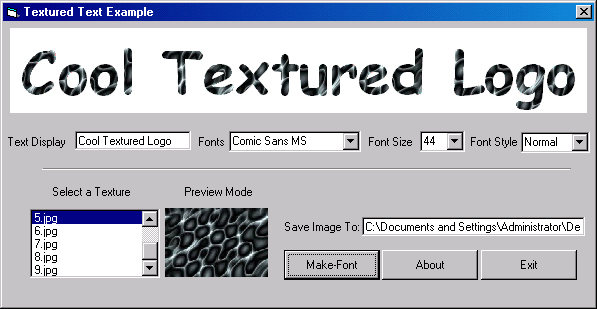



## Textured Text

### Description

Hi this is a simple little project that I made as part of a program I am makeing. well what this code allows you do do is create a Text logo with a Textured foreground colour. I seen lots of exaples were people have used gradient colour but never texture well I have never got them work. well this ones works quite well and is also quite fast anyway see what you think please vote for me if you like this code.
 
### More Info
 

             |
---                |---
**Submitted On**   |2001-12-01 05:49:34
**By**             |[dreamvb](https://github.com/Planet-Source-Code/PSCIndex/blob/master/ByAuthor/dreamvb.md)
**Level**          |Intermediate
**User Rating**    |4.7 (14 globes from 3 users)
**Compatibility**  |VB 6\.0
**Category**       |[Graphics](https://github.com/Planet-Source-Code/PSCIndex/blob/master/ByCategory/graphics__1-46.md)
**World**          |[Visual Basic](https://github.com/Planet-Source-Code/PSCIndex/blob/master/ByWorld/visual-basic.md)
**Archive File**   |[Textured\_T3868211302001\.zip](https://github.com/Planet-Source-Code/dreamvb-textured-text__1-29360/archive/master.zip)

